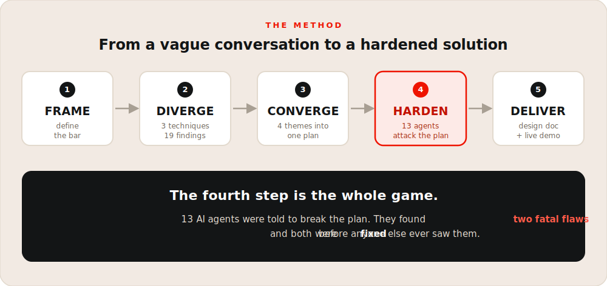

# Broker Copilot

**An AI copilot for commercial insurance brokers.** It helps a broker capture a sufficient risk profile in a single client call and package a targeted submission for the right 2-3 carriers, without losing the prospect to follow-up drop-off.

This is a self-initiated design exercise. I took a loosely-stated problem from a conversation, in a domain I am not an expert in, and worked it into a hardened solution using AI as a structured thinking partner and, just as importantly, an adversary. The three documents here are the solution, the method, and the receipts.

  

## The idea in one line

Stop asking every carrier's questions on one call and picking carriers afterward. That is backwards, and it is why the call runs long, the question tree is unmaintainable, and prospects vanish. Instead, figure out which handful of carriers a business can win while you are still on the phone, ask only what those carriers actually care about, and end the call with a price and a story instead of homework.

## What's inside

Read them in this order:

| Document | What it is |
|---|---|
| [docs/system-design.md](docs/system-design.md) | **The solution.** What to build, how it works, the phased plan, the risks, and a buildable demo. Quick for a non-technical reader up top, deep for a technical one underneath. |
| [docs/methodology.md](docs/methodology.md) | **How it got built.** A repeatable pipeline (Frame, Diverge, Converge, Harden, Deliver) that turns a vague ask into a solution stress-tested by 13 AI agents whose only job was to break it. |
| [docs/brainstorming-findings.md](docs/brainstorming-findings.md) | **The receipts.** The full working record: every idea, dead end, and finding, in the order it surfaced. The appendix, not the pitch. |

## Why it might be worth ten minutes

The method has a self-correction step built in. The first tidy recommendation was handed to a panel of AI agents told to embarrass it, and they found two fatal flaws: a data-moat story that does not survive real submission volume, and a carrier-matching approach that would quietly poison the exact carrier relationships it was meant to protect. Both were rebuilt before any of this was written down. Finding your own fatal flaws before anyone else does is the entire point.
